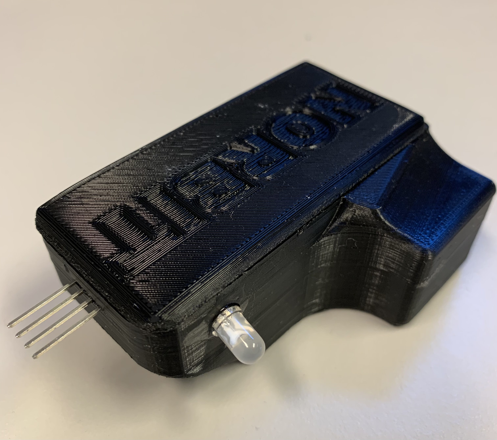
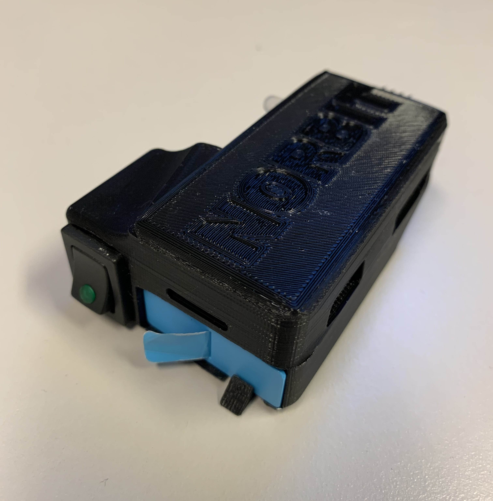
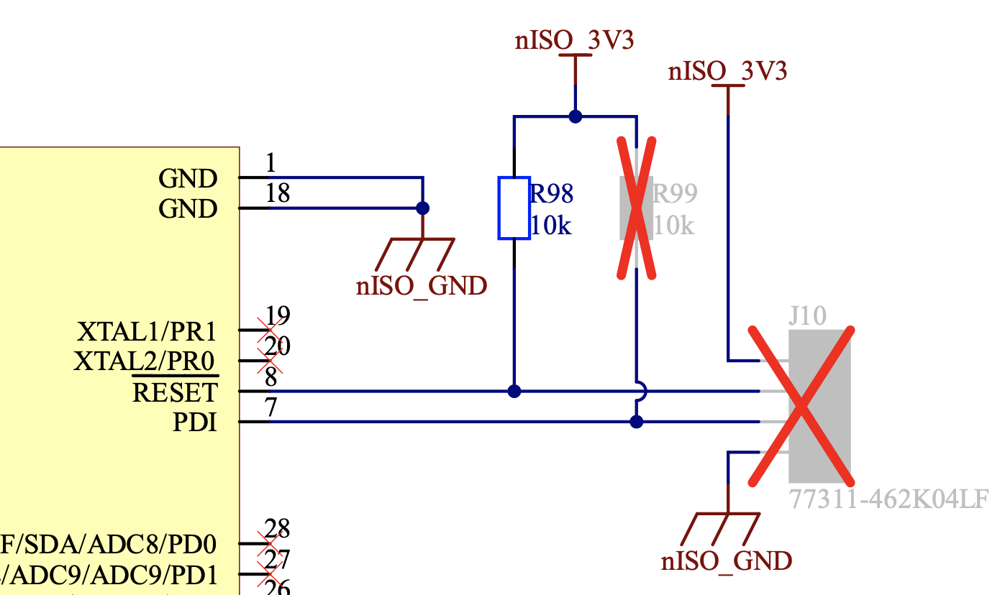
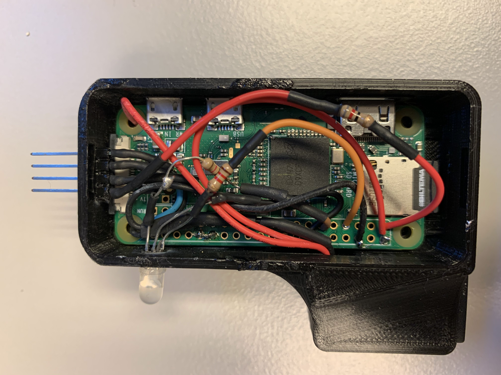

## PSU Programmer Project

PSU programming stick which can be used to program PSU boards on PCB boardstacks.

## Usage

First, use the switch next to the battery port to power on the programmer.

Once booted, the programmer will host a web server at psu-programmer.local, must be on Norbit Exrtra to access.
At this site, you can upload a hex file that you want to write, or select proceed to continue to the activation page.
At psu-programmer.local/folder, you can select which file you want as the active write file that will be writen to the memory of the microcontroller.

To use the programmer, simply insert the pins into the programming pins for the microcontroller and press the button.
The programmer will pulse red and green while it is programming, and will shine green once the board is properly programmed.
After the LED turns off, the programmer can be used again.

The programmer must be inserted with the NORBIT logo facing away from the center of the board in order to work.

Please turn off the switch when done using to preserve battery power.

## Interface

The PSU boards on the PCB boardstacks rev6 and earlier use a PDI interface to program the microcontroller. This programming stick uses a raspberry pi zero in order to interface with the PDI interface, and write hexfiles into the memory of the microcontroller. The microcontroller on the PSU boards is an ATxMEGA 16e5, and the pinout is as follows (J10 on image):

In order to comminicate with the microcontroller from the pi, we use the GPIO pins. For this purpose, the pin named PDI is going to be connected to DATA and the pin named RESET is going to be connected to and used as the CLOCK.  In this case, we use the 3v3 output from the pi and one of the ground pins on the pi in order to power the PSU board while connected. More importantly, GPIO pin 26 is used as for the CLOCK, and GPIO pin 21 is used for DATA. using these connections, we can use the PDI interface to program the microcontroller. In order to interface with the microcontroller, a seperate github project was used as the source code. For reference, the flash page size for this microcontroller is 128 words and the flash base address is 0x008000000.

Source code for PDI interface: https://github.com/buildbotics/rpipdi

Some changes were made to this source code in order to debug and make it work for the application. Notable changes were ignoring some errors and upping retry rate.

Updated source code: https://github.com/MSNetrom/rpipdi

Using this source code, all you have to do is enter the rpipdi folder and use the sudo ./rpipdi command to excecute write and erase commands. When using this command, always -c and -d values must be entered. These are the values for which GPIO pins correspond clock and data, in our case -c is 26 and -d 21. NOTE: libcm2835 library must be installed for this program to function. 

## upload.py

upload.py creates a web page at psu-programmer.local which is used to upload hex files that will be written to the PSU board. It also creates a page at psu-programmer.local/folder where you can select from previous uploads which file to use as the active write file. The pi is running on the Norbit Extra network, which must also be used by the device trying to access the web page. This application saves the most recently active file to the rpipdi folder, so the programmer can also be used without having to access the web page, it will just use whichever file is activated. This script uses sytemd to run at boot, the service name is upload.service.

## button.py

button.py is just a small script which listens for a button press and then excecutes the ./rpipdi command in order to write the currently active file to the microcontrollers memory. It also powers on a LED which pulses red and green while programming a shines green for five seconds after successful programming. This script is in an endless loop, so after the LED shuts off, the stick can be used for programming again.

## systemd

This programmer uses systemd in order to run the upload.py and button.py scripts at boot.
The services are named button.service and upload.service respectively.

## Wiring

